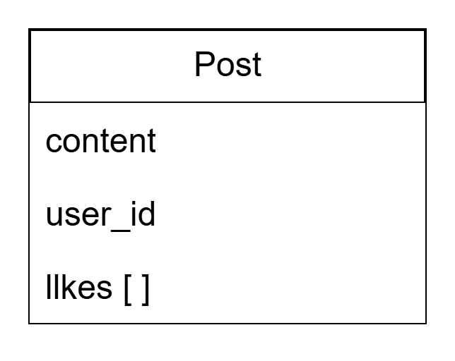

# README

ตอนนี้แอพพลิเคชั่นยังไม่สมบูรณ์

## การออกแบบ

ตัวแอพนี้จะออกแบบให้เหมือนกับ twitter แต่มีแค่

- การเพิ่ม อ่าน แก้ไข ลบ ข้อความ
- การกด like
- การ login

### การเก็บข้อมูลใน DB

เก็บข้อมูล content , user_id ที่ post , เก็บการ likes เป็น arrays เพื่อเก็บ user id ที่ like เพื่อป้องกันการกดซ้ำ

หมายเหตุ : ขอบคุณทางทีมงานที่ให้โอกาสครับ เนื่องจากว่าผมไม่ได้คุ้นชิน framework back-end ส่วนตัวผมถนัด Route Handlers ของ next.js ซึ่งนิยมใช้ front-end framework เลยกลัวจะไม่เหมาะสมกับการทำส่วน back-end จึงต้องใช้เวลาในการศึกษา ruby on rails เพิ่มเติม เลยกินเวลามากขึ้น หากพี่ๆมีแหล่งเรียนรู้เพิ่มเติมไม่ว่าจะเป็นส่วนไหนของ stack สามารถชี้แนะ/feedback กลับมาได้เลยครับ ขอบคุณอีกครั้งครับ
